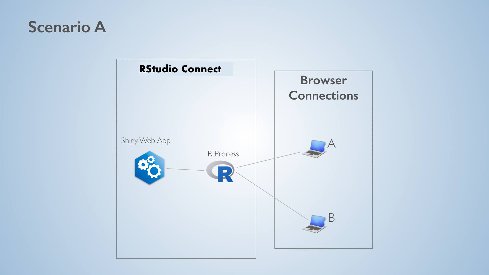
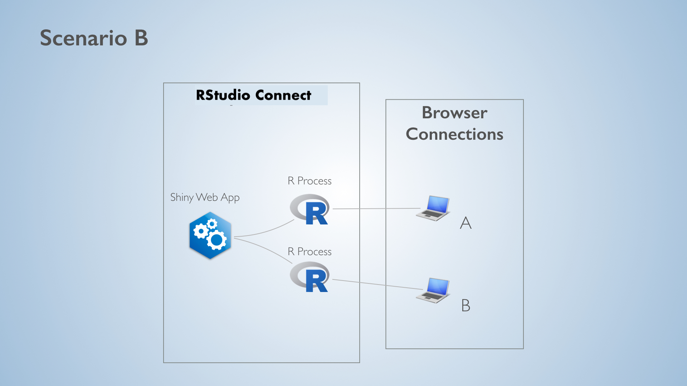

## In this talk

<br /><br />

::: columns
::: column
### [ 1 ]  
Shiny `ExtendedTask`  
& `mirai` integration
:::

::: column
### [ 2 ] 
Distributed computing  
with `mirai` to scale Shiny
:::
:::

## Shiny ExtendedTask

<br/>
<div style="display: flex; gap: 2rem; align-items: left;">
  
  
</div>
<br/>

- 🧠 Unveiled by **Joe Cheng** (creator of Shiny) at *ShinyConf 2024*
- 🚀 Offload long-running tasks to another process  
  → Enables **intra-** and **inter-session** responsiveness
- 🔌 `mirai` is the ideal async counterpart for **Shiny ExtendedTask**

## Shiny ExtendedTask Backends

<br />

### 🔍 mirai vs. future: Key Differences

| Aspect&nbsp;&nbsp;&nbsp;&nbsp;&nbsp;&nbsp;     | **mirai**                                  | **future**                                                   |
|-----------------------------|--------------------------------------------|--------------------------------------------------------------|
| Core purpose                | Async evaluation                           | Parallel processing                                           |
| Always non-blocking        | <span style="color:green">✔</span>        | <span style="color:red">✘</span> (<span style="color:green">✔</span> `future_promise`) |
| Event-driven               | <span style="color:green">✔</span>        | <span style="color:red">✘</span>                            |
| Feels like\*               | `reactive`                                 | `observer`                                                   |

<br/>

<small>\* Not technically equivalent, but intuitive analogies</small>

## The mirai Promise

<br/>

::: columns
::: column
### 🚀 Responsive
- <span style="color:green">✔</span> Sub-millisecond response times  
- <span style="color:green">✔</span> Low overhead, zero latency
:::

::: column
### 📈 Scalable
- <span style="color:green">✔</span> Thousands of processes  
- <span style="color:green">✔</span> Millions of tasks
:::

::: column
### 🧩 Flexible
- <span style="color:green">✔</span> Mix local & remote processes  
- <span style="color:green">✔</span> Dynamic autoscaling
:::

::: column
### ✨ Seamless
- <span style="color:green">✔</span> Full Shiny integration
- <span style="color:green">✔</span> Tight low-level coupling
:::

:::

## Syntax

<br />

###  🔄 Quick Comparison

| **Function**                   | **mirai**             | **future**                             |
|------------------------------|-----------------------|----------------------------------------|
| Create async task            | `mirai()`             | `future_promise()`                     |
| Set up local background processes | `daemons(6)`          | `plan(multisession, workers = 6)`      |

## Scaling Solutions in Context

<br />

::: columns
::: column
### Before


:::

::: column
### After


:::
:::

## Intra-Session Async

<br />

### ✅ Solved: Shiny `ExtendedTask` 

<br />


- 🧠 **Run in background**  
  Offload heavy tasks — compute, I/O, APIs

- 🚦 **UI stays responsive**  
  No session blocking

- 📊 **Serve more users**  
  Fewer duplicated processes, higher scalability

- 🔌 **`mirai` efficiency**  
  Lowers hurdle to using ExtendedTask

## How Does `mirai` Work?

::: columns
::: column
### 🖥️ Local

- 📡️️ `daemons(url = local_url())`  
  Opens a local IPC socket  
  e.g. `"abstract://85de9c..."`

- 🛰️️ `launch_local()`  
  Launches 1 local daemon

<div style="height: 5.4em;"></div>

- `daemons(6)`  
  Sets and launches 6 local daemons

:::

::: column
### 🌐 Distributed

- 📡️️ `daemons(url = host_url())`  
  Opens a TCP network socket  
  e.g. `"tcp://myhostname:40491"`

- `launch_remote()`  
  Shows shell command to connect

- 🛰️`launch_remote(remote = ssh_config("ssh://192.168.0.10"))`  
  Launches 1 remote daemon

<div style="height: 1em;"></div>

- `daemons(6, url = host_url(), remote = ssh_config("ssh://192.168.0.10"))`  
  Sets and launches 6 remote daemons

:::
:::

## Distributed Computing over Tunnelled SSH

> 🔐 **SSH tunnelling allows the remote machine to connect back to your network socket as if it were local to that machine**


#### 🥇 Step 1: Create the remote launch configuration

``` r
cfg <- ssh_config("ssh://192.168.0.10", tunnel = TRUE)
```
<br />

#### 🥈 Step 2: Set daemons using a local TCP URL

``` r
daemons(n = 2, url = local_url(tcp = TRUE), remote = cfg)
```
<br />

#### 🥉 Step 3: Launch and scale (with optional auto-scaling)

``` r
launch_remote(n = 2, remote = cfg)
launch_remote(n = 2, remote = cfg, idletime = 1000 * 60)
```
<br />

## Thanks

#### Scaling Shiny: Seamless and Effortless Distributed Computing with mirai

<p><br /><br />
<br /><br /></p>

<https://github.com/r-lib/mirai>